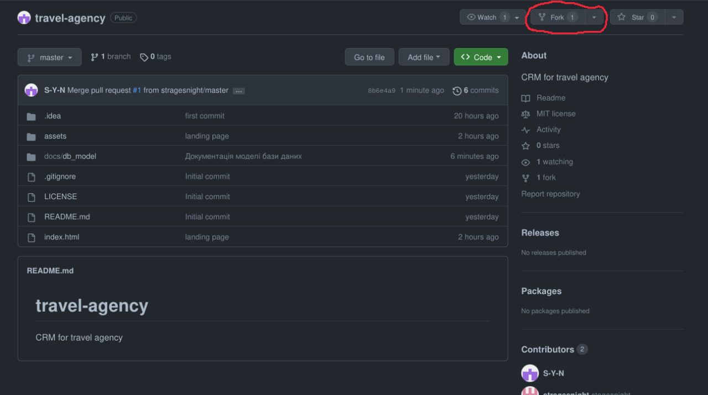
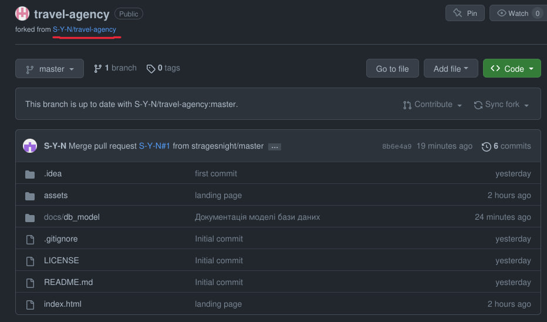
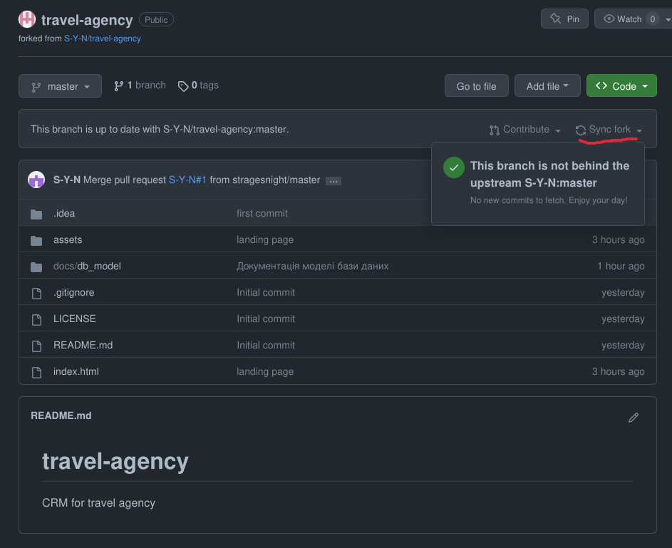
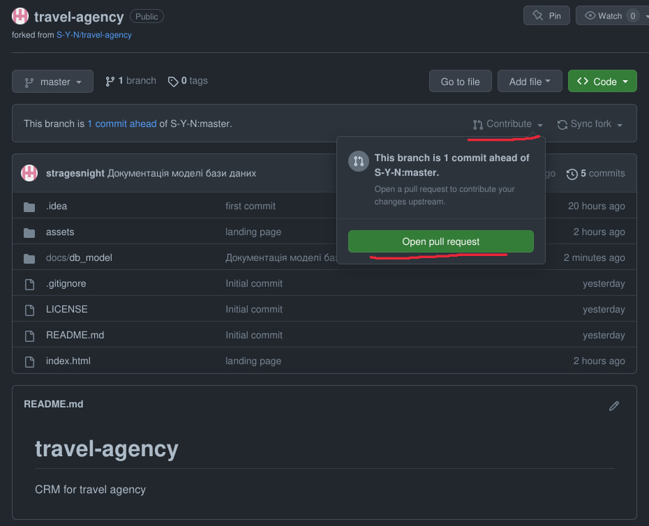

# Як вносити свої зміни до загального репозиторію проекту

У цьому документі описаний алгоритм дій, які потрібно виконати задля внесення своїх змін до репозиторію проекту.


## 1. Впевніться, що ви увійшли до свого аккаунту GitHub

За потреби створіть новий аккаунт та увійдіть до нього. Думаю ви це зробите без особливих проблем :)

## 2. Створіть форк репозиторію

Форк - ваша особиста копія репозиторію. Клонувати на локальну машину, створювати комміти, пушити ви будете в свій форк.

### Для створення форку вам необхідно:

1. Перейти до потрібного вам репозиторію (у даному випадку - https://github.com/S-Y-N/travel-agency, в якому ви зараз і знаходитесь)
2. Натиснути на кнопку Fork, яку виділено на зображенні нижче.
3. Та слідувати подальшим інструкціям.



Після цього, ви повинні опинитись на сторінці свого форку, як ілюстровано на зображенні:


## 3. Завантажте ваш форк на свій локальний робочий комп'ютер

Якщо ви ще цього не зробили - завантажте та встановіть Git із сайту https://git-scm.com/downloads.

Після цього склонуйте репозиторій зручним для вас способом. Якщо не знаєте як, слідуйте наступним інструкціям:
1. Відкрийте програму `Git Bash`
2. Перейдіть до потрібної вам папки за допомогою команди `cd`
3. виконайте наступну команду, замінивши `<адреса_форку>` на фактичне посилання на ваш __форк__ (а не на цей репозиторій):
```bash
git clone <адреса_форку>
```

Після виконання цих кроків ви готові до виконання своєї роботи над проектом.

## Ремарка

    Пункти 1, 2 та 3 вам потрібно виконати лише один раз - на початку роботи над проектом!
    Наступні кроки вам потрібно виконувати кожен раз при внесенні змін до проекту!

## 4. Синхронизуйте зміни з основного репозиторію

Синхронізуйте дані свого форку з основним репозиторієм, перейшовши на сторінку свого форку та натиснувши на кнопку `Sync fork`. Якщо репозиторії вже синхронізовані, з'явиться повідомлення як на зображенні нижче:


Інакше, натисніть на кнопку синхронізації у цьому віконці та слідуйте інструкціям сайту.

Далі, потрібно синхронізувати локальний репозиторій, використовуючи зручний вам спосіб. Якщо не знаєте як, слідуйте наступним інструкціям:
1. Відкрийте програму `Git Bash`
2. Перейдіть до папки з проектом
3. виконайте наступну команду:
```bash
git pull
```

## 5. Внесіть зміни до локальних файлів проекту

Тут все просто - виконайте дане вам завдання, відредагувавши та створивши необхідні файли у кодовому редакторі вашого вибору.

## 6. Створіть комміт для ваших змін та оновіть репозиторій

Створіть комміт за допомогою програми `git` або засобів вашого кодового редактора - Visual Studio Code, Web Storm або ін., та запуште зміни на репозиторій на GitHub. Якщо не знаєте, слідуйте наступним інструкціям:
1. Відкрийте програму `Git Bash`
2. Перейдіть до папки з проектом
3. виконайте наступні команди:
```bash
git add --all
git commit -am "<опис_комміту>"
git push
```

## 7. Відкрийте пул-реквест

Останній крок - вам необхідно відкрити пул-реквест (pull-request) для того, щоб зміни у вашому форку додались до основного репозиторію. Для цього перейдіть на сторінку вашого форку та натисніть кнопку `Contribute`, потім на `Open pull request`, як показано на зображенні нижче та слідуйте подальшим інструкціям.


Після цього ваш код перевірить наш техлід, та якщо все добре, то додасть зміни на основний репозиторій.

Якщо у вас є якісь запитання - пишіть проджект-менеджеру в особисті повідомлення в телеграмі, або гугліть.

Удачі :)